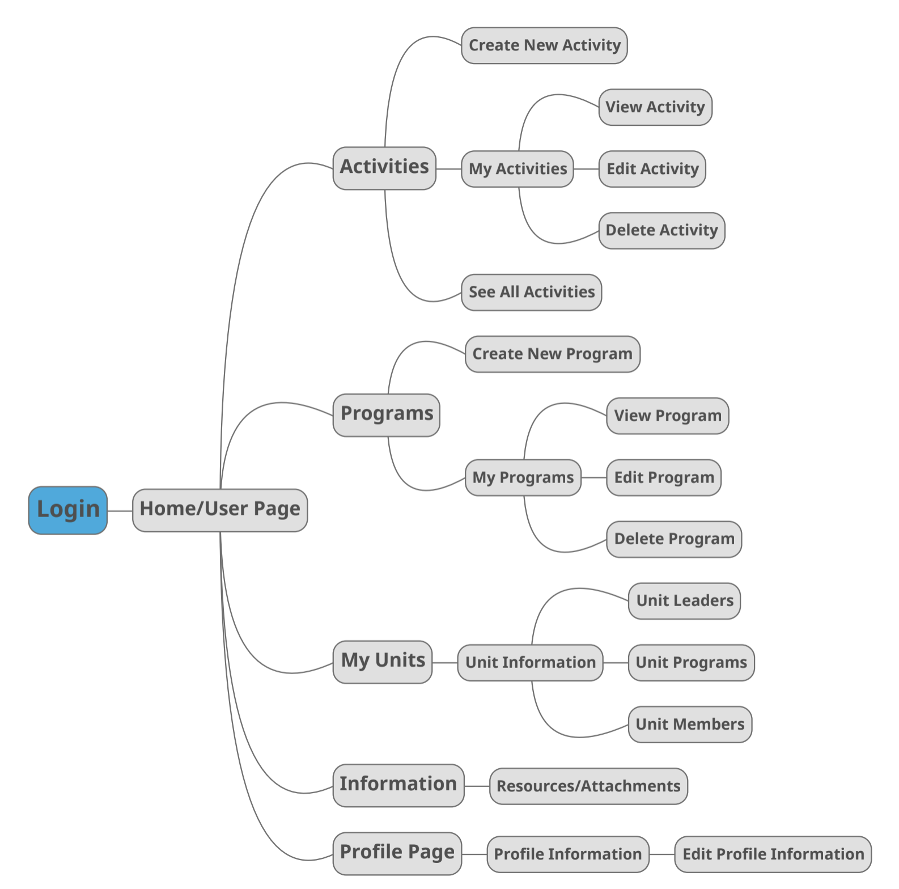
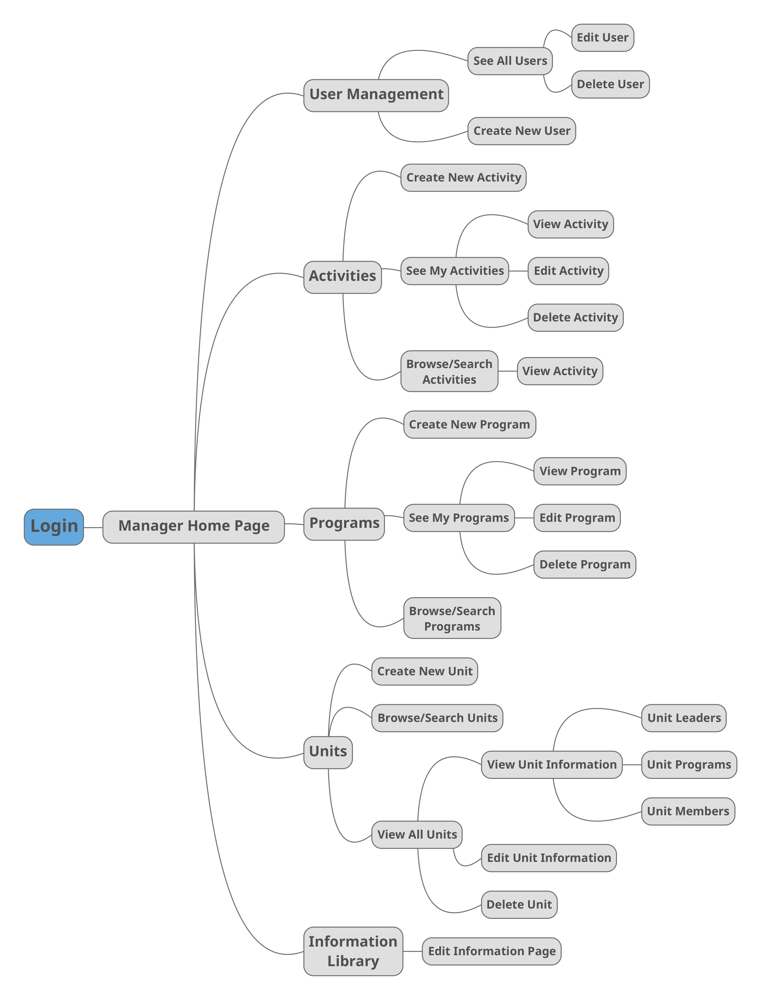
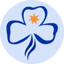
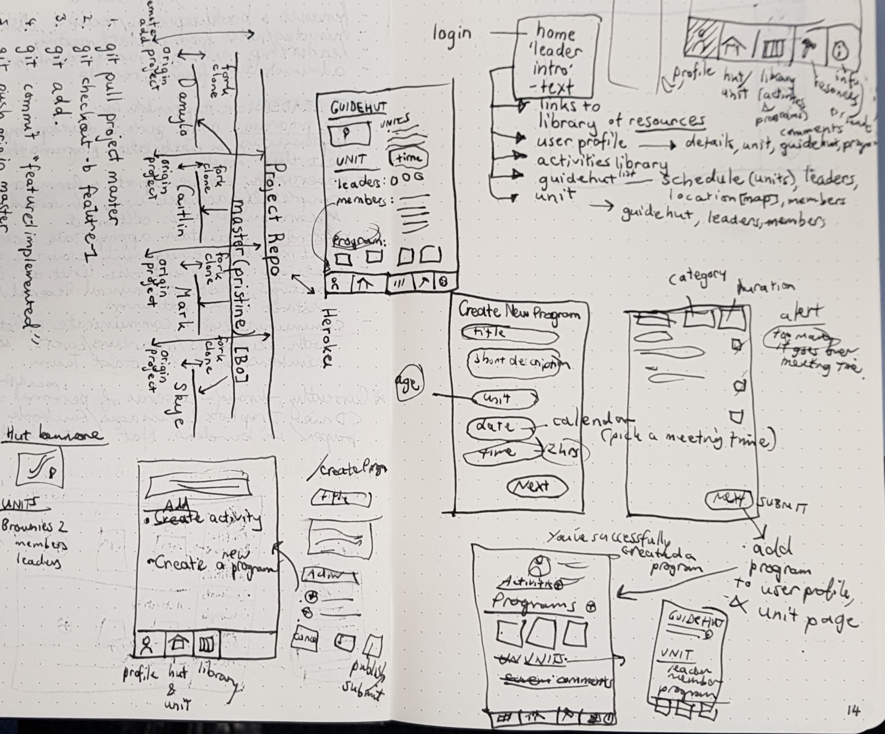
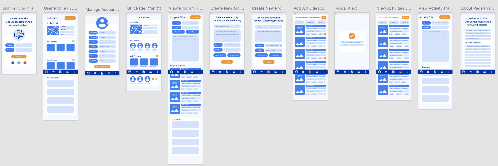
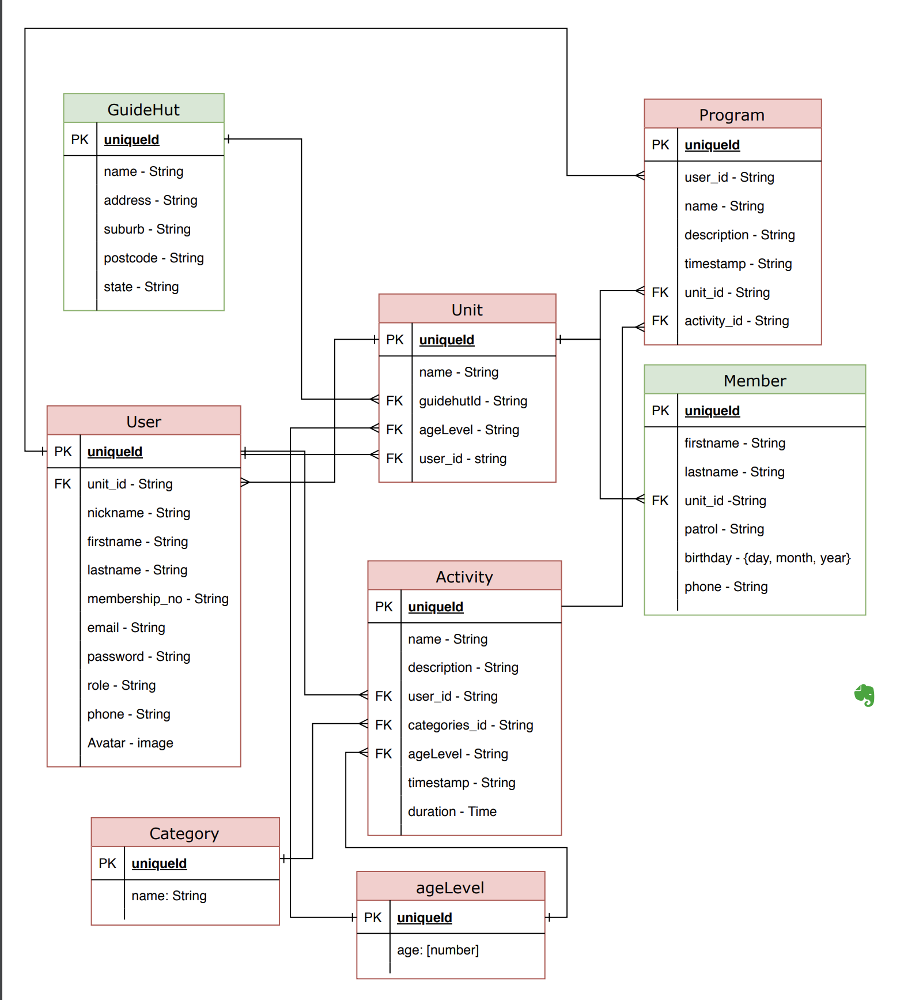
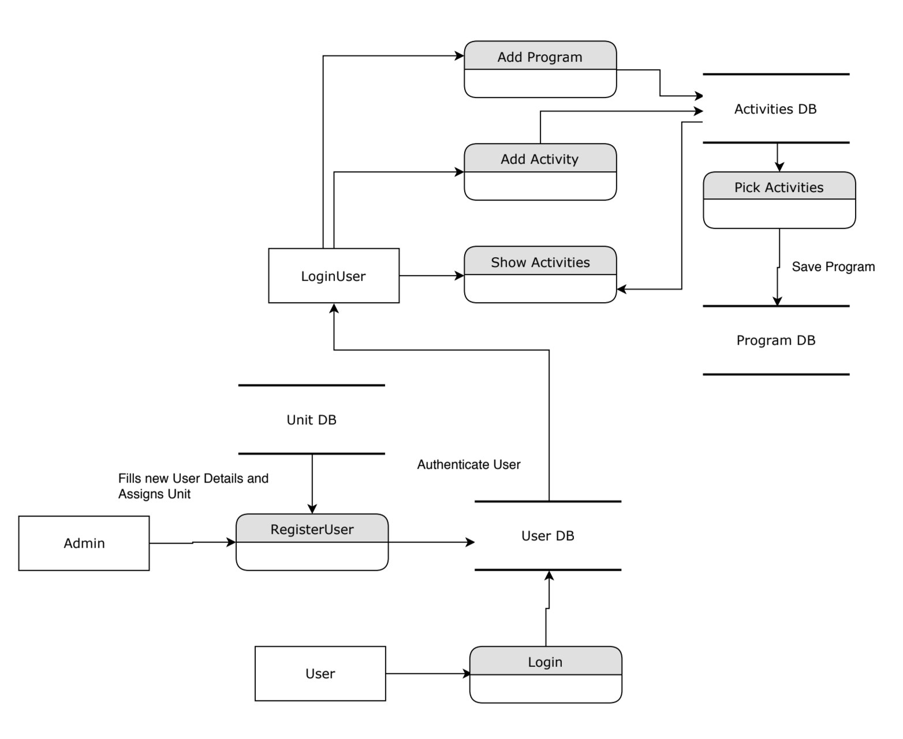
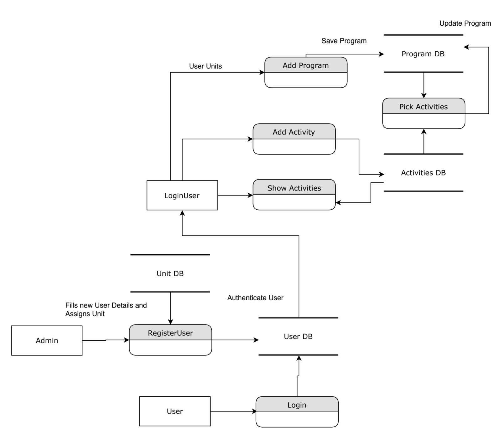
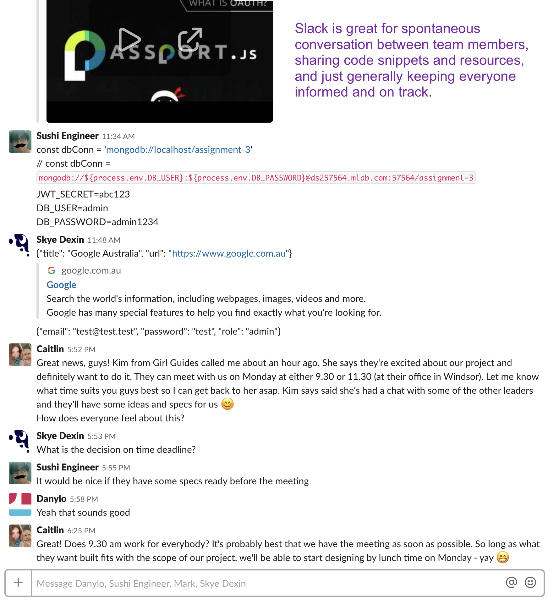
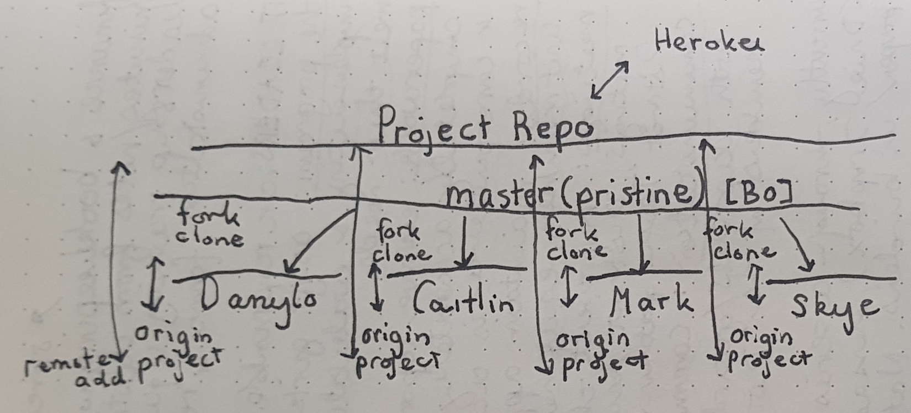

# Girl Guides Helper App

Deployed on Netlify: [Girl Guides Helper App (Client)](https://5c3db9c1268ad9f0e15ddad0--assignment3-client.netlify.com)

Deployed on Heroku: [Girl Guides Helper App (Server)](https://assignment3-client.herokuapp.com/)

**Dev Team:** @asunanto (Bo), @watsbeat (Caitlin), @DanBytes (Danylo), @markconanan (Mark), @Shadow-Blitz (Skye).

# Contents

- [Introduction](#introduction)
  - [Project Brief](#project-brief)
  - [Problem](#problem)
  - [Solution](#solution)
  - [Tech Stack](#tech-stack)
- [Application Design](#application-design)
  - [User Stories](#user-stories)
  - [User Journeys](#user-journeys)
  - [Style Guide: Colours, Fonts, Graphics](#style-guide)
  - [Wireframes](#wireframes)
  - [Database Schema Design](#database-schema-design)
  - [Dataflow Diagram](#dataflow-diagram)
  - [Object-Oriented Design Notes](#object-oriented-design-notes)
- [Project Management](#project-management)
  - [Project Charter](#project-charter)
  - [Project Breakdown & Schedule](#project-breakdown--schedule)
  - [Team Management](#team-management)
  - [Task Delegation & Monitoring](#task-delegation--monitoring)
  - [Post-Project Review](#post-project-review)
  - [Client Satisfaction Questionnaire](#client-satisfaction-questionnaire)
- [Tools & Methodologies](#tools--methodologies)
  - [Agile](#agile)
  - [Trello](#trello)
  - [Slack](#slack)
  - [GitHub](#github)
  - [Code Review](#code-review)
  - [Client Communication](#client-communication)
- [Short-Answer Questions](#short-answer-questions)
- [Installation / Setup / Deployment](#installation--setup--deployment)

# Introduction

## Project Brief
For our final assignment at [Coder Academy](https://coderacademy.edu.au/?ads_adid=64025306771&ads_cmpid=1525122602&ads_creative=289578508313&ads_matchtype=e&ads_network=g&ads_targetid=kwd-337602022756&ttv=2&utm_campaign=Paid%20Search&utm_medium=ppc&utm_source=adwords&utm_term=coder%20academy&gclid=Cj0KCQiA4aXiBRCRARIsAMBZGz8mDm8r11xtFP88vq3iiqbxuHySpbBrb_Oonivk3qsWLwA2_tLCUqIaAtvPEALw_wcB), we were asked to design, build and deploy an application that solves a problem for a real-world client (using MERN stack).

## Problem

**Client**: [Girl Guides Queensland](https://www.guidesqld.org/gg)

Our aim is to reduce the time volunteers have to spend planning and doing administrative tasks during their week, so that when they turn up at their unit meeting they are relaxed, organised and can focus on enjoying the experience and leading the girls.

## Solution
_"A resource manager app for new leaders."_

To achieve this, we proposed an app that allows users to collaboratively create programs from an activities database. 

Users can add activities to the database with relevant information like: description, instructions, duration, resources needed, theme, age level, related badges, rating etc. 

Users can view the complete library of activities and comment on them, e.g. “This activity is gre[]at for end of term celebrations,” or “Tried this with my Brownies unit. At least two supervising leaders are needed for it to go smoothly, as the instructions are a little tricky for the girls to understand straight-away.” 

Users can attach files (pdfs, docs, images etc.) needed for running the activity; these can be download or viewed in the app. This means that, instead of printing activity instructions, the patrols could view it in an iPad during meetings.

On a user’s profile page, they can display programs and activities they’ve created. Another idea is to have a page for each unit, where all members/leaders associated with that unit can view the history of programs. That way, when leaders change, they can see what activities were run in the recent past and avoid repetition.

Another extra feature we could have is a way to store information about the members, i.e. the girls themselves. It would be helpful for leaders to be able to keep track of which girls are going for certain badges.

## Tech Stack

**Built with:**

- [MongoDB](https://www.mongodb.com/)
- [Express](https://expressjs.com/)
- [React](https://reactjs.org/)
- [Node.js](https://nodejs.org/en/)

# Application Design

## User Stories

See this [Trello Board](https://trello.com/b/XKKr8jof/user-stories) for our complete list of user stories organised by priority and t-shirt sizes.

## User Journeys

**Leaders:**

**Managers/Admin:**

## Style Guide

Our colours specifications, logo usage and branding was informed by the existing [style guidelines](https://www.guidelinesforgirlguides.org.au/wp-content/uploads/2015/10/GGA-Style-Guide-updated-Dec-2014.pdf) for Girl Guides Australia.

### CSS Framework

We decided to use [Material-UI](https://material-ui.com/) as our component library. For one, it's great for prototyping; standing on Google's shoulders, we can craft a persuasive user experience quickly and easily. It's a tried-and-true visual system that encourages us to think about information hierarchy and promotes consistent look that many users will be accustomed to already. Plus, Material Design offers many of the standard components we'll be using in our own app - buttons, icons, modals, navbars, cards etc. 

However, while Material Design's flat, clean aesthetic integrates well with our own designs, we may still want to customise futher using React [styled-components](https://www.styled-components.com/).

### Colours

Color | Hex
----- | -----
Blue | #0033A1
Havelock Blue | #4C70BD
Sky Blue | #D4E2FB
Pale Blue | #F5F9FF
White | #FFFFFF
Orange | #EC963A

### Fonts

### Graphics

## Wireframes

** Initial Sketches**

** Low-Fidelity:

** Video Walkthrough:**

## Database Schema Design

Per our assignment requirements, we are using MongoDB - a NoSQL database with no relationships between tables. To allow us to design a schema with validation, we have implemented Mongoose as an npm package.

**Entity Relationship Diagram:**

## Dataflow Diagram

## Object-Oriented Design Notes

# Project Management

## Project Charter

## Project Breakdown & Schedule

## Team Managment

After discussing our individual strengths and things we'd like to learn, we allocated roles and responsibilities among team members as follows:

- **Bo & Mark:** server-side development, Dev Ops, backend test design, authentication and authorisation on the server
- **Caitlin:** client relations, documentation, design direction, frontend development, backend development when needed
- **Danylo & Skye:** API integration, frontend development, frontend test design, authentication and authorisation on the client

## Task Delegation & Monitoring

## Post-Project Review

### Challenges

### Improvements

## Client Satisfaction Questionniare

_How satisfied was the client with our product and services?_

# Tools & Methodologies

### Agile

1. StandUp Meetings
2. Brainstorming Sessions
3. Scrum Board

### Trello

We used Trello as our project management tool. We tracked our build progress using the Kanban process it offers.

You can view our Trello Board [here](https://trello.com/b/2FbFSl6m/web-app).

### Slack

When we're not at campus together, and even when we are :wink:, Slack is our main communication tool.

### GitHub

We used GitHub for our version control. We each forked and cloned the project repository to our local machines and set up remote connections. Then, we followed a feature-branch workflow for committing and merging changes to the pristine master branch on the project repository:

1. git pull project master
2. git checkout -b feature-1
3. git add .
4. git commit "feature-1 implented"
5. git push origin master
6. git push origin feature-1 
7. merge into project master via pull request on GitHub

### Code Review

Before merging pull requests into the pristine master branch, we assign another team member to review our code. If their are no major conflict, we generally approve the requests straight-up even if some refactoring needs to be done. This is because we have limited time to build the app, and properly drying out the code and doing comprehensive testing can still happen later. So long as the requestor appropriately names the branch, write good commits messages and leaves comments.

### Client Communication

Meeting minutes, emails etc.

# Short-Answer Questions

### 1. What are the most important aspects of quality software?

- performs to specifications
- easy to manage
- readable and maintainable code with comments
- functional and usable
- accessible
- responsive
- intuitive
- innovative
- end-user understandable

### 2. What libraries are being used in the app and why?

**Server:**

- [body-parser](https://www.npmjs.com/package/body-parser): parses incoming request bodies so that the server could process the data, i.e storing it in models/database.
- [cookie-parser](https://www.npmjs.com/package/cookie-parser): parses cookie header and populates req.cookies.
- [cors](https://www.npmjs.com/package/cors): provides a middleware that can be used to enable cors. We enable all cors request (allows communication from different domains) for the sake of simplicity
- [dotenv](https://www.npmjs.com/package/dotenv): loads environment variable to process.env. We can store sensitive information here such as our password for our database.
- [express](https://www.npmjs.com/package/express): a web framework for node which greatly reduces the code output.
- [express-acl](https://www.npmjs.com/package/express-acl): an authorisation package that handles requests made to the server.
- [express-session](https://www.npmjs.com/package/express-session): enables the server to store and access sessions (quite handy!).
- [jsonwebtoken](https://www.npmjs.com/package/jsonwebtoken): provides a way to securely exchange of information in JSON format between client and server.
- [mongoose](https://www.npmjs.com/package/mongoose): a package that was built above mongoDB and helps build model classes and schemas.
- [passport](https://www.npmjs.com/package/passport): an authentication package for users/
- [passport-jwt](https://www.npmjs.com/package/passport-jwt): a passport strategy by authenticating with JWT.
- [passport-local-mongoose](https://www.npmjs.com/package/passport-local-mongoose): a Mongoose plugin that simplifies building username and password.

**Client:**

- [axios](https://www.npmjs.com/package/axios): makes http requests from server safer and easier.
- [jwt-decode](https://www.npmjs.com/package/jwt-decode): decodes JWT tokens from server.
- [react](https://www.npmjs.com/package/react): creates user interfaces; contains functionality necessary to define react components.
- [react-dom](https://www.npmjs.com/package/react-dom): provides DOM methods that can be used at the top-level of the app, e.g. render().
- [react-router](https://www.npmjs.com/package/react-router): provides routing functionality on the client.
- [react-router-dom](): provides DOM bindings for react-router.
- [react-scripts](https://www.npmjs.com/package/react-router-dom): includes scripts and configuration used by Create React App.

**Dev Dependencies:**
- [react-test-renderer](https://www.npmjs.com/package/react-test-renderer): provides an experimental react renderer that can be used to render react components without depending on the DOM. This makes it easy for us to grab snapshots to perform some test with our react components
- [enzyme](https://www.npmjs.com/package/enzyme): a testing utility which makes it easier to assert, manipulate, and traverse your React Components' output. This is used for mocking to spy on functions.

### 3. A team is about to engage in a project, developing a website for a small business. What knowledge and skills would they need in order to develop the project?

Soft skills are essential for us developers. We must not only know how to build software, but also how to communicate and deal with clients and fellow team members. We can't develop a solution without first understanding what the client's needs really are - and checking-in with them regularly to make sure we're staying on the right track. Likewise, communicating with our fellow team members helps everyone to know what they are doing. This way we can avoid mistakes like duplicated or missing work, merge conflicts etc.

On a technical level, it doesn't really matter what stack the developer is using so long as they have an deep understanding of it and how it can cater to the clients needs.

### 4. What knowledge or skills were required to complete your own project and overcome challenges?

### 5. Evaluate how effective your knowledge and skills were in this project, using examples, and suggest changes or improvements for future projects of a similiar nature.

# Installation / Setup / Deployment

Clone a copy of this repo to your local machine: 
`git clone git@github.com:asunanto/assignment3-client.git`

Make sure [nodemon](https://nodemon.io/) and [mongodb](https://www.npmjs.com/package/mongodb) are installed globally on your machine.

## Setup

**Frontend**

1. Open the frontend folder: `cd frontend`
2. Install npm packages: `npm install`
3. Launch the server: `npm start`
4. Go to `localhost:3000` in your web browser

**Backend**

1. Open the backend folder: `cd backend`
2. Install npm packages: `npm install`
3. Launch the server: `nodemon server` or `node server`
3. Go to `localhost:3000` in your web browser

## Deployment

### Via Heroku

1. Set up an account with [Heroku](https://www.heroku.com/), a cloud platform for deploying and running apps.
2. Login to Heroku from both your frontend and backend directories: `heroku login`